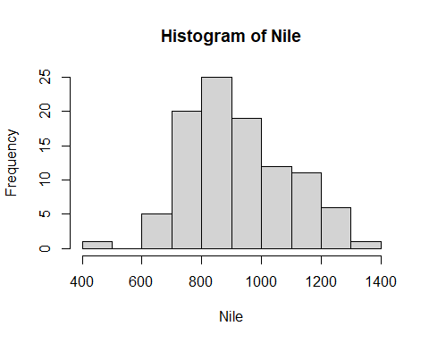

# Preview of R data Structures
## Introduction
R encompass various data structures, at this point, we will discuss the frequent used structures in R that is more influential for data analytics. Here, we will illustrate some of the meaningful examples regarding to the data structures. This overview of the data structures give highlight of syntax and semantics of how R works. Indeed, the preview of data structure dive deep in telling the story about Vector, List, strings, and matrices.The chunks of code to whole presentation will be carried out through the Window environment. 
## R Object
R comprised of the five atomic object to run smoothly. The character, numeric(real number), integer, complex and logical(TRUE/FALSE). The most used object in the R programming is vectors. The R object has its own set with regard to attributes, these are alternatively branded as a metadata to the object. Of course, the metadata explain the object in R. Detailing out examples of the attributes in R important before describing the data structures in R. That said, the R attributes contain dimensions (matrices or arrays), class(integer or numeric), length, and dimensions names. 

### Vectors
The heart of R programming is vectors, to make a deeply interaction with the R session, the vectors are the workhorse in the R environment. In fact, the vector normally works very well in R session if analysts managed to program in a same mode. (c) is the function used to create vectors objects and concatenating all the staffs in one pack.  

```r
x<-8
x
```

```
## [1] 8
```
The above example demonstrated different types of vector underscored by attributes.For example, [1] show the row number begin with 1, R treat X as vector, vector with one element. 
### Character strings 
R has the capability to manipulate the character strings, in fact, character strings are the are single elements vector in a character mode. 

```r
x<-c(1,2,3,4)
x
```

```
## [1] 1 2 3 4
```

```r
length(x)
```

```
## [1] 4
```

```r
mode(x)
```

```
## [1] "numeric"
```

```r
y<-"abc"
length(y)
```

```
## [1] 1
```

```r
mode(y)
```

```
## [1] "character"
```
Regarding the two example above R has the function to manipulate the strings, in the first example we created the vector as the numeric while the second we exercised one string vector.

```r
u<-paste("abc","de", "f")#concatenating the strings
u
```

```
## [1] "abc de f"
```

```r
v <- strsplit(u," ") # split the string according to blanks
v
```

```
## [[1]]
## [1] "abc" "de"  "f"
```
### Matrices
R matrix correspond to the maths that has the same name, these are the rectangular arrays number. To build the conceptual model in PLS-PM in R, matrix is the workhorse. In a technical tersm, matrix is the vector. 

```r
m <- rbind(c(1,4),c(2,2))
m
```

```
##      [,1] [,2]
## [1,]    1    4
## [2,]    2    2
```


```r
m1 <- matrix(1:6, nrow = 2, ncol = 3)
m1
```

```
##      [,1] [,2] [,3]
## [1,]    1    3    5
## [2,]    2    4    6
```
From the above two example, we created two separate vector, we created matrix using the rbind function and the latter, the matrix function. The rbind stand for row bind function that used to build the matrix from the two separate vectors. At the same time, the cbind stand for combine several column to develop the matrix. The second example we created the m1 as matrix and pass it to the matrix functions by naming the number of rows as well as the column.
### List
List is similar to vectors in R programming, but its contents poses different data types. To be more precise, the lists posit different classes, in that sense, the so-called "apply" functions are embedded in a list. 

```r
x1<-list(1, "ab", TRUE,1+4i)
x1
```

```
## [[1]]
## [1] 1
## 
## [[2]]
## [1] "ab"
## 
## [[3]]
## [1] TRUE
## 
## [[4]]
## [1] 1+4i
```
Next, we created a list with the vector.

```r
x2<-vector("list", length = 8)
x2
```

```
## [[1]]
## NULL
## 
## [[2]]
## NULL
## 
## [[3]]
## NULL
## 
## [[4]]
## NULL
## 
## [[5]]
## NULL
## 
## [[6]]
## NULL
## 
## [[7]]
## NULL
## 
## [[8]]
## NULL
```

```r
hist(Nile)
```

<!-- -->
We used the ready made data set that available in R to exercised how the above data structures in R works.The data set called the Nile River Data sets.  

```r
hn<-hist(Nile)
```

<!-- -->

```r
print(hn)
```

```
## $breaks
##  [1]  400  500  600  700  800  900 1000 1100 1200 1300 1400
## 
## $counts
##  [1]  1  0  5 20 25 19 12 11  6  1
## 
## $density
##  [1] 0.0001 0.0000 0.0005 0.0020 0.0025 0.0019 0.0012 0.0011 0.0006 0.0001
## 
## $mids
##  [1]  450  550  650  750  850  950 1050 1150 1250 1350
## 
## $xname
## [1] "Nile"
## 
## $equidist
## [1] TRUE
## 
## attr(,"class")
## [1] "histogram"
```


```r
str(hn)
```

```
## List of 6
##  $ breaks  : int [1:11] 400 500 600 700 800 900 1000 1100 1200 1300 ...
##  $ counts  : int [1:10] 1 0 5 20 25 19 12 11 6 1
##  $ density : num [1:10] 0.0001 0 0.0005 0.002 0.0025 0.0019 0.0012 0.0011 0.0006 0.0001
##  $ mids    : num [1:10] 450 550 650 750 850 950 1050 1150 1250 1350
##  $ xname   : chr "Nile"
##  $ equidist: logi TRUE
##  - attr(*, "class")= chr "histogram"
```

```r
head(hn)
```

```
## $breaks
##  [1]  400  500  600  700  800  900 1000 1100 1200 1300 1400
## 
## $counts
##  [1]  1  0  5 20 25 19 12 11  6  1
## 
## $density
##  [1] 0.0001 0.0000 0.0005 0.0020 0.0025 0.0019 0.0012 0.0011 0.0006 0.0001
## 
## $mids
##  [1]  450  550  650  750  850  950 1050 1150 1250 1350
## 
## $xname
## [1] "Nile"
## 
## $equidist
## [1] TRUE
```

```r
class(hn)
```

```
## [1] "histogram"
```
### Data Frames 
The normal data set usually have numerous set of data with various format. The data frames in R is called the list. It is due to the fact that the data frames. Let massage a data frames in R

```r
d <- data.frame(list(kids=c("Jack","Jill"),ages=c(12,10)))
d
```
### Classes 
R programming language is the Object Oriented Program(OOP), in R, Object are referred to the classes. During the day of the course we introduce the historical background of R,R stem from the old S language.Most of R is based on these classes, and they are easy to use.

```r
print(hn)
```

```
## $breaks
##  [1]  400  500  600  700  800  900 1000 1100 1200 1300 1400
## 
## $counts
##  [1]  1  0  5 20 25 19 12 11  6  1
## 
## $density
##  [1] 0.0001 0.0000 0.0005 0.0020 0.0025 0.0019 0.0012 0.0011 0.0006 0.0001
## 
## $mids
##  [1]  450  550  650  750  850  950 1050 1150 1250 1350
## 
## $xname
## [1] "Nile"
## 
## $equidist
## [1] TRUE
## 
## attr(,"class")
## [1] "histogram"
```
Looking again in this example the attribute described as the class.

# System and Files
In a window environment R is very effective for file manipulation,of course, this start from creating data files and checking dates. R has handy function to make some maneuver between the data file and checking the dates. We are going to look at the current date, time and time zones

```r
Sys.Date()
```

```
## [1] "2022-11-06"
```

```r
Sys.time()
```

```
## [1] "2022-11-06 12:04:39 EAT"
```

```r
Sys.timezone()
```

```
## [1] "Africa/Nairobi"
```
Time is very helpful if the data analyst are work remotely, each one contributes to the project that has been going one for a while and changes submitted to the remote repository, before uploading the changes using Git, its is recommended to check the time to other location. 

```r
getwd()
```

```
## [1] "C:/Users/bwabo/OneDrive/Desktop/Data Science/Regression Models/Introduction-to-R-programming-for-data-analytics"
```

```r
file.exists("C:/Users/bwabo/OneDrive/Desktop/Data Science/Regression Models/Introduction-to-R-programming-for-data-analytics")
```

```
## [1] TRUE
```
# Data Input and Output
Getting the data sets into the R is the next challenges, The analysts need to be more precisely about this, any mistakes might get the whole project to unnecessary problem. text tab and comma separate value are the most common files used in R.Next, common data file types include Microsoft Excel, SPSS, SAS, and Stata. The R packages are most robust to handle different data file format. 

## Native data sets
For the analysts started the data science as a unique specialization must choose the appropriate machine to be used, and understand the pro and cons between the window and OS. To weight out the advantages and disadvantage for each is important. As the example shown above, OS use the forward lash while the window is backlash. I personally, I have been used the window, so the entire presentation will be carried out through window only. 
## Fixed formats data set
From the above chunk of code, we imports the data set into R using the read.table function. What is read.table? It can take numerous basic file type and read them as the data frame. 
## Input
example of how R read data sets from other format

```r
install.packages("foreign")
```

```
## Error in install.packages : Updating loaded packages
```

```r
library(foreign)
```
The above packages is crucial to analyst because file from different files format can be integrated in R environment. 

